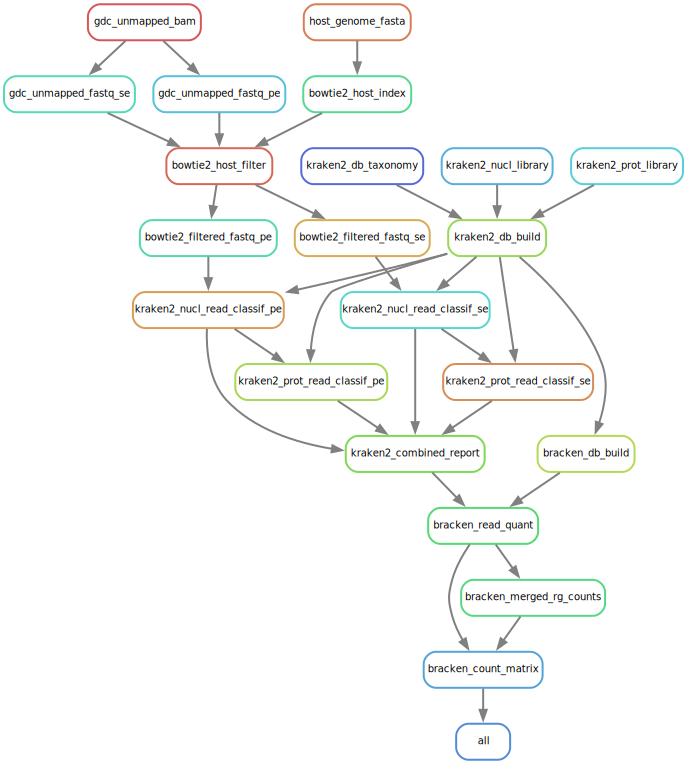

# tcga-wgs-kraken-microbial-quant

A Kraken-based pipeline for classifying and quantifying microbial
reads from GDC TCGA WGS data. Properly handles TCGA WGS merged
BAMs with mixed SE and PE reads or multiple read lengths when needed
by splitting to read-group level FASTQs and processing data at
read-group level through the pipeline before merging results.
See [References](#references) for the basis for this pipeline and
more information.

TCGA WGS Unmapped BAMs -> Biobambam2 Unmapped FASTQs ->
Bowtie2 Host Filtering (T2T-CHM13v2.0) -> Filtered BAMs ->
Biobambam2 Filtered FASTQs -> KrakenUniq Read Classification ->
BBMap Read Length -> Bracken Read Quantification ->
Count Matrix



### Prerequisites

The project was developed under GNU Linux and MacOS and assumes the
use of a Unix command line shell. Both Linux and MacOS provide a
command line shell by default. Other needed tools will be installed
by the instructions below.

### Installation

Install and set up
[Miniforge3](https://github.com/conda-forge/miniforge#miniforge3)

Obtain the project source and create a conda environment with the tools
needed to run the project:

```bash
git clone https://github.com/hermidalc/tcga-wgs-kraken-microbial-quant.git
cd tcga-wgs-kraken-microbial-quant
mamba env create -f envs/tcga-wgs-kraken-microbial-quant.yaml
mamba activate tcga-wgs-kraken-microbial-quant
```

### Execution

Set the GDC controlled-access authentication token in `config/config.yaml`:

```yaml
input:
  mode: gdc
  gdc:
    token: ''
```

Run the workflow:

```bash
snakemake --use-conda --printshellcmds
```

### References

1. Lu et al. [Metagenome analysis using the Kraken software suite](
    https://www.ncbi.nlm.nih.gov/pmc/articles/PMC9725748/).
Nat Protoc. 2022 Dec;17(12):2815-2839. doi: 10.1038/s41596-022-00738-y
2. Ge et al. [Comprehensive analysis of microbial content in whole-genome
sequencing samples from The Cancer Genome Atlas project](
    https://doi.org/10.1101/2024.05.24.595788). bioRxiv 2024.05.24.595788
3. Gihawi et al. [Major data analysis errors invalidate cancer microbiome
findings](https://pubmed.ncbi.nlm.nih.gov/37811944/). mBio. 2023 Oct
31;14(5):e0160723. doi: 10.1128/mbio.01607-23
